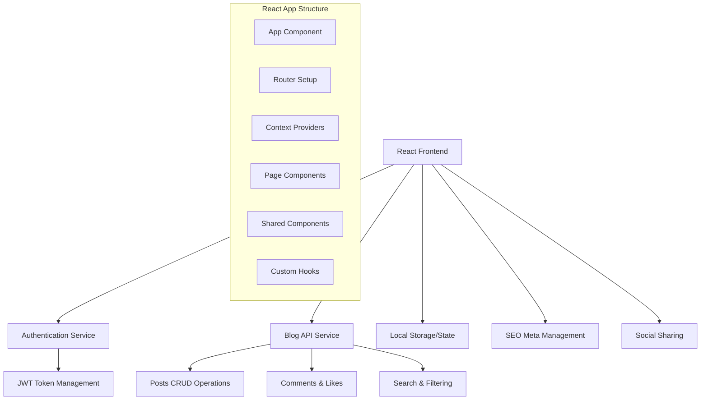
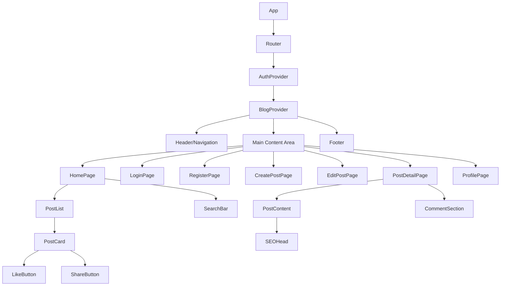

# Design Document

## Overview

The React Blog Tutorial is designed as a progressive learning application that teaches React fundamentals through building a complete blog platform. The architecture emphasizes modern React patterns, hooks, and best practices while maintaining educational clarity. The application will be built incrementally over 30 days, with each phase introducing new React concepts and features.

## Architecture

### High-Level Architecture



### Technology Stack

- **Frontend Framework**: React 18+ with functional components and hooks
- **Routing**: React Router v6 for SPA navigation
- **State Management**: React Context API + useReducer for global state
- **Styling**: CSS Modules with responsive design principles
- **HTTP Client**: Axios for API communication
- **Authentication**: JWT tokens with localStorage persistence
- **Development Tools**: Create React App/Vite, ESLint, Prettier
- **Testing**: Jest + React Testing Library
- **SEO**: React Helmet for meta tag management

## Components and Interfaces

### Core Component Hierarchy



### Key Component Interfaces

#### Authentication Components
- **LoginForm**: Email/password input with validation
- **RegisterForm**: User registration with confirmation
- **ProtectedRoute**: Route wrapper for authenticated access
- **AuthContext**: Global authentication state management

#### Blog Components
- **PostCard**: Displays post preview with metadata
- **PostForm**: Create/edit post form with rich text support
- **PostDetail**: Full post view with comments and engagement
- **CommentList**: Displays and manages post comments
- **LikeButton**: Interactive like/unlike functionality
- **ShareButton**: Social media sharing options

#### Layout Components
- **Header**: Navigation with user menu
- **Sidebar**: Categories and recent posts
- **Footer**: Site information and links
- **LoadingSpinner**: Reusable loading indicator
- **ErrorBoundary**: Error handling wrapper

### Custom Hooks

```javascript
// Authentication hooks
useAuth() // Current user state and auth methods
useLogin() // Login form logic and validation
useRegister() // Registration form logic

// Blog functionality hooks
usePosts() // Posts CRUD operations
usePost(id) // Single post management
useLikes(postId) // Like/unlike functionality
useComments(postId) // Comments management
useSearch() // Search and filtering logic

// Utility hooks
useLocalStorage(key) // Persistent local storage
useDebounce(value, delay) // Debounced input handling
useSEO(metadata) // SEO meta tag management
```

## Data Models

### User Model
```javascript
interface User {
  id: string;
  email: string;
  username: string;
  firstName: string;
  lastName: string;
  avatar?: string;
  createdAt: Date;
  updatedAt: Date;
}
```

### Post Model
```javascript
interface Post {
  id: string;
  title: string;
  content: string;
  excerpt: string;
  slug: string;
  authorId: string;
  author: User;
  category: string;
  tags: string[];
  likesCount: number;
  commentsCount: number;
  isPublished: boolean;
  createdAt: Date;
  updatedAt: Date;
  seoMetadata: SEOMetadata;
}
```

### Comment Model
```javascript
interface Comment {
  id: string;
  content: string;
  postId: string;
  authorId: string;
  author: User;
  parentId?: string; // For nested comments
  createdAt: Date;
  updatedAt: Date;
}
```

### Like Model
```javascript
interface Like {
  id: string;
  postId: string;
  userId: string;
  createdAt: Date;
}
```

### SEO Metadata Model
```javascript
interface SEOMetadata {
  title: string;
  description: string;
  keywords: string[];
  ogTitle?: string;
  ogDescription?: string;
  ogImage?: string;
  twitterCard?: string;
}
```

## Error Handling

### Error Boundary Implementation
- **Global Error Boundary**: Catches unhandled React errors
- **Route-Level Boundaries**: Isolate errors to specific pages
- **Component-Level Handling**: Form validation and API errors

### Error Types and Handling
```javascript
// API Error handling
interface APIError {
  status: number;
  message: string;
  field?: string; // For validation errors
}

// Error handling patterns
try {
  const response = await api.createPost(postData);
} catch (error) {
  if (error.status === 401) {
    // Redirect to login
  } else if (error.status === 422) {
    // Show validation errors
  } else {
    // Show generic error message
  }
}
```

### Loading States and UX
- **Skeleton Loading**: For post lists and content areas
- **Button Loading States**: During form submissions
- **Progressive Loading**: Load critical content first
- **Offline Handling**: Graceful degradation when offline

## Testing Strategy

### Unit Testing Approach
- **Component Testing**: Test component rendering and user interactions
- **Hook Testing**: Test custom hooks in isolation
- **Utility Testing**: Test helper functions and utilities
- **API Testing**: Mock API calls and test error scenarios

### Integration Testing
- **User Flow Testing**: Complete authentication and posting flows
- **Route Testing**: Navigation and protected route access
- **State Management Testing**: Context and reducer functionality

### Testing Structure by Learning Phase
```javascript
// Phase 1: Authentication (Days 1-5)
describe('Authentication', () => {
  test('user can register with valid credentials');
  test('user can login with existing account');
  test('protected routes redirect unauthenticated users');
});

// Phase 2: Post CRUD (Days 6-19)
describe('Post Management', () => {
  test('user can create a new post');
  test('posts display correctly on homepage');
  test('user can edit their own posts');
  test('user cannot edit others posts');
});

// Phase 3: Engagement (Days 20-25)
describe('Post Engagement', () => {
  test('user can like and unlike posts');
  test('like count updates correctly');
  test('social sharing generates correct URLs');
});
```

### Educational Testing Concepts
- **Test-Driven Development**: Write tests before implementation
- **Mocking**: Mock API calls and external dependencies
- **Snapshot Testing**: Ensure UI consistency
- **Accessibility Testing**: Test keyboard navigation and screen readers

## Performance Optimization

### React Performance Patterns
- **React.memo**: Prevent unnecessary re-renders
- **useMemo/useCallback**: Optimize expensive calculations
- **Code Splitting**: Lazy load routes and components
- **Virtual Scrolling**: For large post lists

### Bundle Optimization
- **Tree Shaking**: Remove unused code
- **Dynamic Imports**: Load features on demand
- **Asset Optimization**: Compress images and fonts
- **CDN Integration**: Serve static assets efficiently

### SEO Performance
- **Server-Side Rendering**: Consider Next.js for production
- **Meta Tag Management**: Dynamic SEO metadata
- **Structured Data**: JSON-LD for rich snippets
- **Social Media Optimization**: Open Graph and Twitter Cards

## Security Considerations

### Authentication Security
- **JWT Token Management**: Secure storage and refresh patterns
- **Input Validation**: Client and server-side validation
- **XSS Prevention**: Sanitize user-generated content
- **CSRF Protection**: Token-based request validation

### Data Protection
- **Sensitive Data Handling**: Never store passwords in state
- **API Security**: Proper error handling without data leaks
- **User Privacy**: Respect user data and provide controls

## Development Phases and Learning Objectives

### Phase 1: Foundation (Days 1-5)
**React Concepts**: Components, JSX, Props, State, Event Handling
**Features**: Project setup, authentication, routing basics

### Phase 2: Core Functionality (Days 6-15)
**React Concepts**: useEffect, Custom Hooks, Context API, Forms
**Features**: Post creation, reading, basic CRUD operations

### Phase 3: Advanced CRUD (Days 16-19)
**React Concepts**: useReducer, Error Boundaries, Performance optimization
**Features**: Post editing, deletion, advanced state management

### Phase 4: User Engagement (Days 20-25)
**React Concepts**: Event handling, Conditional rendering, API integration
**Features**: Like/unlike system, social sharing, user interactions

### Phase 5: SEO and Optimization (Days 26-28)
**React Concepts**: React Helmet, Performance hooks, Code splitting
**Features**: SEO metadata, social media optimization, performance tuning

### Phase 6: Polish and Advanced Features (Days 29-30)
**React Concepts**: Testing, Accessibility, Production deployment
**Features**: Search functionality, comments, responsive design, final optimizations